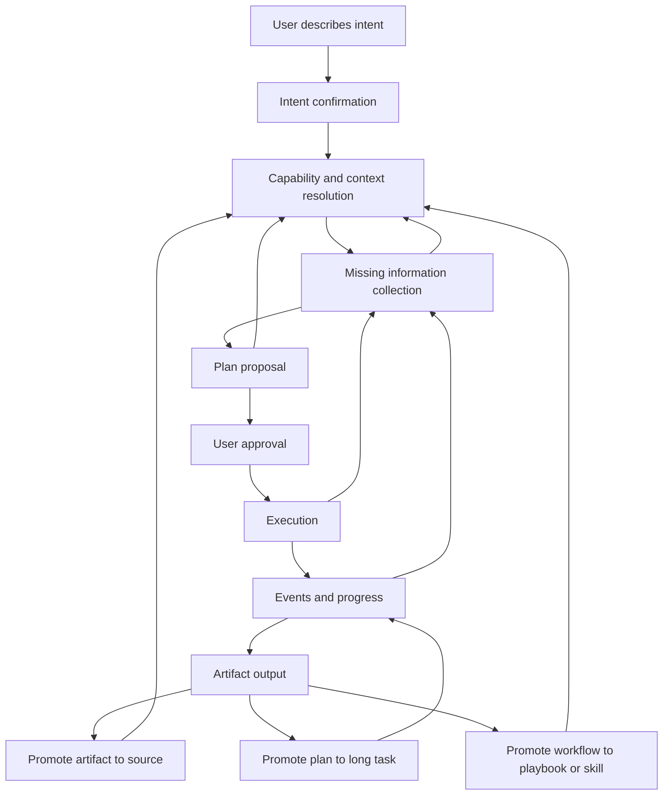
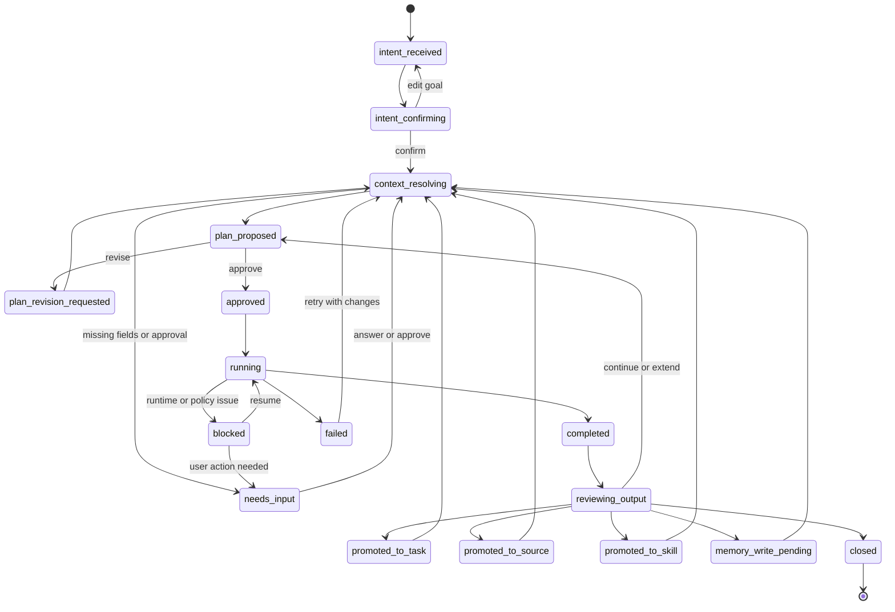

# Cognix Agentic Product Direction

This document defines the target product path for Cognix after the notebook-style
UI migration. It is based on the current codebase capability check and is meant
to guide implementation sequencing.

## 1. Target User Flow

The default product flow is a loop, not a one-way wizard. A conversation run can
move forward, pause, ask for more information, revise its plan, continue
execution, produce artifacts, and then turn those artifacts back into future
context or reusable capabilities.



The user should not need to understand agents, MCP, skills, scheduler, memory,
or sandbox details. These are internal capability choices.

User-facing concepts:

- **Conversation**: the only primary entry point.
- **Sources**: selected context used by the run.
- **Tasks**: confirmed recurring or long-running jobs.
- **Studio / Outputs**: reports, datasets, browser captures, code apps, files,
  playbooks, and reusable outputs.
- **Needs Input**: typed forms or approval buttons when the run is blocked.

Advanced concepts such as raw agents, runtime nodes, policy logs, MCP servers,
and raw task payloads should stay under developer details.

## 2. Conversation Run Loop

The product should treat every request as a durable `ConversationRun`. Chat
messages are only one view of the run. The run owns intent, selected sources,
capability resolution, plan snapshots, approvals, execution events, artifacts,
and promotion decisions.

The loop has six important properties:

1. **Intent is revisable**: the user can correct the interpreted goal before a
   plan is generated.
2. **Information collection can repeat**: missing URL, credentials, field scope,
   file format, schedule, locale, or approval can be requested in multiple
   rounds without losing previous answers.
3. **Plan proposal can iterate**: the user can ask for a cheaper, safer, faster,
   scheduled, or more comprehensive plan before execution.
4. **Execution can pause and resume**: browser login, CAPTCHA, policy approval,
   runtime dependency issues, and field ambiguity should enter a resumable
   blocked state.
5. **Artifacts are not the end**: every output can become a source, playbook,
   skill, memory candidate, scheduled task, or code project input.
6. **Promotion feeds the next run**: promoted sources, tasks, skills, playbooks,
   and memory are returned to the Capability Resolver and become available to
   future planning.

Recommended loop:



### 2.1 Run Object Contract

The backend should persist a run object instead of deriving state from chat
messages and approvals.

Recommended shape:

```json
{
  "id": "run_123",
  "workspace_id": "workspace_123",
  "chat_id": "chat_123",
  "user_id": "user_123",
  "state": "plan_proposed",
  "locale": "zh-CN",
  "timezone": "Asia/Shanghai",
  "intent": {
    "raw": "拉取林客昨日支付券码",
    "summary": "Fetch yesterday's LinKe payment coupon-code data.",
    "confidence": 0.86,
    "confirmed": true
  },
  "sources": [
    {
      "id": "memory:workspace",
      "kind": "memory",
      "version": 1
    }
  ],
  "capabilities": [
    {
      "id": "browser.automation",
      "kind": "browser_automation",
      "selected": true
    }
  ],
  "requirements": [
    {
      "id": "target_url",
      "label": "目标页面 URL",
      "required": true,
      "status": "answered",
      "value_ref": "answer_123"
    }
  ],
  "plan_id": "plan_123",
  "execution_id": "exec_123",
  "artifact_ids": ["artifact_123"],
  "promotion_candidates": {
    "task": true,
    "source": true,
    "skill": false,
    "memory": true
  }
}
```

### 2.2 Loop Events

Events should be stable and UI-oriented. Technical backend events can exist, but
the product surface should consume normalized run events:

| Event | Meaning |
|---|---|
| `run.intent_detected` | Model produced an intent summary. |
| `run.intent_confirmed` | User confirmed or edited the intent. |
| `run.context_resolved` | Sources and capabilities were resolved. |
| `run.input_requested` | System needs typed user input. |
| `run.input_answered` | User answered a requirement. |
| `run.plan_proposed` | A user-facing plan is ready. |
| `run.plan_revised` | Plan was regenerated after user feedback. |
| `run.approved` | User approved execution. |
| `run.started` | Execution started. |
| `run.step_started` | One plan/workflow step started. |
| `run.step_blocked` | Step needs approval, login, dependency, or user input. |
| `run.step_completed` | Step completed. |
| `run.artifact_created` | Output artifact was created. |
| `run.completed` | Run completed. |
| `run.failed` | Run failed with a recoverable or terminal error. |
| `run.promoted_to_task` | Plan was converted to a long-running or scheduled task. |
| `run.promoted_to_source` | Artifact was registered as a selectable source. |
| `run.promoted_to_skill` | Playbook/skill was created from a workflow. |
| `run.memory_write_requested` | Long-term memory write needs approval. |

### 2.3 UI Consequences

The center panel should not show raw planner JSON. It should show the current
loop state:

- `intent_confirming`: a compact intent summary with confirm/edit buttons.
- `needs_input`: typed fields with validation, suggested answers, and one
  continue button.
- `plan_proposed`: a plan card with approach, outputs, risks, access, cost, and
  execution mode.
- `running`: timeline steps with status and concise progress.
- `blocked`: one recovery card with the exact next action.
- `completed`: artifact summary plus suggested next actions.

The left panel should show:

- **Chats**: conversation sessions.
- **Tasks**: only user-confirmed long-running or scheduled jobs.
- **Sources**: files, URLs, memory, artifact sources, and selected task outputs.

The right Studio should show outputs and promotion suggestions. It should not
become a second approval surface unless the center conversation is not visible.

## 3. Current Support Matrix

| Capability | Current support | Code references | Gap |
|---|---:|---|---|
| Intent to plan | Partial | `cognix/planner/service.py` | Planner mixes intent confirmation, missing input, plan generation, and execution preparation. It needs a durable loop run state. |
| Capability resolver | Partial | `cognix/planner/capabilities.py` | Resolver exposes skills, MCP, connectors, browser, sandbox, memory, but ranking and policy-aware capability selection are still shallow. |
| Human-in-loop | Partial | `cognix/local/approvals.py`, `cognix/planner/service.py`, `web/src/features/workspace/SimpleMode.tsx` | Lacks durable typed question schemas, answer suggestions from memory, and clean loop re-entry after every state transition. |
| Browser automation | Partial | `cognix/browser/service.py`, `docs/architecture/browser-automation-layering.md` | Runtime supports Playwright, CDP, and browser-use contracts, but optional dependencies, profile management, action-level execution, and UI recovery are not product-complete. |
| Plan to one-shot task | Supported | `PlannerService._apply_create_task`, `TaskExecutor` | Needs better status model and user-facing progress. |
| Plan to scheduled task | Partial | `SchedulerEngine`, `TaskStore`, `ScheduledTaskModel` | Scheduler can run cron/interval, but there is no first-class "promote this successful plan to recurring task" loop action. |
| Browser task scheduling | Partial | `PlannerService._apply_browser_run`, `TaskType.BROWSER_AUTOMATION` | Can create scheduled browser tasks, but the UI does not present recurring browser runs as a safe confirmed task template. |
| Artifact output | Supported | `ArtifactModel`, `cognix/api/routes/artifacts.py` | Artifact exists, but artifact-to-source is not yet a first-class backend contract. |
| Artifact to playbook/skill | Partial | `cognix/api/routes/playbooks.py`, `PlaybookModel` | Extraction and promotion exist, but need review gates, validation, and marketplace/local hub UX. |
| Artifact to source | Partial | `SourcesPanel.tsx` source model supports `artifact`, but current source list mainly includes memory, URLs, files, and scheduled tasks. | Need backend source registry and source lineage. |
| Code output and preview | Partial | `cognix/local/code_sandbox.py`, workspace code-project routes | Can create and start projects, but isolation is process-level, not a hardened sandbox. Needs policy, dependency install strategy, logs, previews, and cleanup. |
| Multi-agent orchestration | Supported at runtime layer | `cognix/orchestrator/*`, Hermes Agent runtime | Planner does not yet consistently map complex user goals into agent teams and task DAGs. |
| MCP and skills | Partial to supported | `cognix/mcp/*`, `cognix/skills/*`, workspace routes | Tool discovery and workspace config exist. Product should hide raw config and expose capability presets. |
| Memory and RAG | Partial | `cognix/core/memory.py`, `CapabilityResolver.memory` | Needs MemoryRouter, context budget, source attribution, memory write approval, and answer suggestion for repeated HITL questions. |
| Multi-language | Missing | no frontend i18n framework detected | Need locale detection, user/workspace language settings, backend localized prompts, and translated UI strings. |

## 4. Product State Machine

The center conversation should be driven by a durable run state. Recommended
states:

| State | Meaning | User sees |
|---|---|---|
| `intent_received` | Raw user request captured. | User message. |
| `intent_confirming` | System summarizes what it thinks the user wants. | "I understand you want..." with confirm/edit buttons. |
| `collecting_context` | Sources, memory, skills, MCP, browser, scheduler, and sandbox are resolved. | Short status, not raw technical details. |
| `needs_input` | Missing required information or approval. | Typed form or explicit approve/reject buttons. |
| `plan_proposed` | System has a concrete approach. | Human-readable plan, outputs, risk, cost, schedule. |
| `approved` | User approved execution. | Run begins. |
| `running` | Execution active. | Timeline with steps and events. |
| `blocked` | Execution cannot continue without user action or configuration. | Recovery card with specific next step. |
| `completed` | Outputs produced. | Artifact cards and suggested follow-ups. |
| `reviewing_output` | User reviews output and chooses next action. | Continue, schedule, save as source, make playbook, write memory. |
| `failed` | Run ended with unrecovered error. | Error summary and retry path. |
| `promoted_to_task` | Plan converted into long-running or scheduled job. | Task appears in left Tasks tab. |
| `promoted_to_source` | Artifact can be reused as context. | Source appears in left Sources tab. |
| `promoted_to_skill` | A validated workflow becomes a reusable skill. | Skill appears in workspace capability presets. |
| `memory_write_pending` | System wants to store durable memory. | User approves, edits, or rejects memory write. |
| `closed` | User has ended the run. | Run stays in history. |

This state should be persisted independently of chat messages so refresh and
session switching can re-enter the exact run state. The state model must allow
forward progress and controlled loopbacks. A run should never rely on a polling
side panel to reconstruct whether it is waiting for input, waiting for approval,
running, or completed.

## 5. Plan to Long Task

The product should support converting a successful or reviewed plan into a
long-running or scheduled task.

Recommended API:

```http
POST /api/v1/workspaces/{workspace_id}/plans/{plan_id}/promote-task
```

Request shape:

```json
{
  "name": "Daily coupon code export",
  "schedule": "every 24h",
  "timezone": "Asia/Shanghai",
  "source_policy": {
    "reuse_selected_sources": true,
    "include_memory": true,
    "include_latest_artifacts": false
  },
  "execution_policy": {
    "require_approval_before_external_access": true,
    "require_approval_before_file_write": false,
    "max_runtime_seconds": 1800
  },
  "output_policy": {
    "artifact_type": "report",
    "publish": false,
    "notify_on_completion": true
  }
}
```

Implementation notes:

- Store a normalized plan snapshot, not only the original prompt.
- Persist selected capabilities and source references.
- Store `user_id`, `workspace_id`, provider route, policy mode, timezone, and
  approval rules in the task payload.
- Scheduled execution should create new artifacts per run and link them to the
  task and originating plan.
- The UI should only show tasks after the user confirms promotion. Draft plans
  should stay in the conversation, not in the Tasks tab.

Current code already supports scheduled task primitives through
`ScheduledTaskModel`, `TaskStore`, `SchedulerEngine`, and `TaskExecutor`. The
missing piece is the product-level promotion contract and UI.

## 6. Artifact to Source

Outputs should be reusable context. This is important for a notebook-like product
because every useful result can become future input.

Recommended API:

```http
POST /api/v1/workspaces/{workspace_id}/artifacts/{artifact_id}/promote-source
```

Source shape:

```json
{
  "id": "artifact:abc123:v1",
  "kind": "artifact",
  "title": "Coupon export report",
  "summary": "Extracted yesterday's coupon data from LinKe.",
  "artifact_id": "abc123",
  "version": 1,
  "context_type": "browser",
  "source": "browser_automation",
  "lineage": {
    "plan_id": "plan123",
    "task_id": "task123",
    "agent_id": "agent123"
  },
  "retrieval": {
    "mode": "summary_first",
    "max_tokens": 1200
  }
}
```

Implementation notes:

- A source should not inject the whole artifact by default.
- Use a summary-first context pack, then load full content only when required.
- Preserve artifact version, provenance, source URL/file path, and task lineage.
- The left Sources panel should show artifact sources beside files, URLs, memory,
  and task outputs.
- The planner should receive selected artifact sources through the same source
  contract it receives files and URLs.

Current frontend source types already include `artifact`, but artifact listing is
not wired as a first-class source registry. This should be added before memory
features become deeper, otherwise context will remain implicit and hard to
debug.

## 7. Code Output and Sandbox

Some outputs are code: scripts, apps, browser automations, data pipelines, API
clients, or generated dashboards. These should not be plain chat text.

Target behavior:

1. Planner recognizes code-producing intent.
2. It creates a code project in the workspace sandbox.
3. The sandbox runs only after policy checks.
4. UI shows preview URL, logs, files, and generated artifacts.
5. The final output links to the code project and any produced reports/files.

Current implementation:

- `CodeSandboxStore` creates project directories under the workspace.
- It can start simple `npm`, `node`, or `python` preview commands.
- It captures process logs and preview URL.

Required hardening:

- Use an execution boundary stronger than raw local subprocess for untrusted code.
- Add dependency install policy. For example, allow `npm install` only after
  approval or inside a disposable environment.
- Add filesystem scope enforcement, network policy, runtime timeouts, and cleanup.
- Add per-project artifact production, such as generated files, screenshots, logs,
  and preview metadata.
- Add UI states: created, installing, running, failed, stopped, completed.
- Add "promote code project to source" for generated documentation or output files,
  not for arbitrary source code unless explicitly selected.

Recommended direction:

- Short term: keep local subprocess sandbox for trusted local development.
- Medium term: add Docker or lightweight isolated worktree runner.
- Long term: support pluggable execution backends, such as local, Docker, remote
  worker, or cloud sandbox.

## 8. Browser Automation Direction

Browser automation should remain split into three layers:

- **Browser MCP Runtime**: real executor, hidden from ordinary users.
- **Browser Automation Skill**: generic SOP and safety contract.
- **Domain Skill**: site-specific workflow such as `life_partner_coupon_codes`.

Runtime engines:

- `playwright`: deterministic isolated browser automation.
- `cdp`: attach to user-owned browser/login session.
- `browser_use`: agentic browser operation for ambiguous pages.

Product contract:

- Planner should generate `browser_run` when browser work is required.
- If URL or authorization is missing, ask a typed question.
- If external access requires approval, show an approval button, not a text box.
- If runtime dependencies are missing, produce a recoverable runtime artifact,
  not a chat response telling the user to switch environments.
- Browser results should become artifacts with extracted text, tables, screenshot,
  downloads, URL, engine, profile, and limitations.

Current code supports the core runtime path in `BrowserAutomationService`, but
needs stronger action-level execution and user-facing recovery.

## 9. Memory and Context Budget

Memory should be treated as a source with routing, not as an unlimited prompt
appendix.

Required services:

- `MemoryRouter`: decides hot, cold, procedural, and deep memory retrieval.
- `ContextBudgetManager`: enforces max context and compression strategy.
- `SourceAttributionService`: records which source influenced the plan/output.
- `MemoryWriteApproval`: asks before writing long-term preferences or sensitive
  facts.
- `AnswerSuggestionService`: suggests answers for repeated missing-input prompts
  based on recent approvals, similar tasks, artifact metadata, and memory.

For HITL questions, the UI should show:

- required fields
- suggested answer cards
- source of suggestion
- confidence
- one-click fill
- manual override
- final confirm button

Retrieval order:

1. Current conversation state.
2. Selected sources.
3. Recent task answers in this workspace.
4. Similar prior approvals and form responses.
5. Artifact summaries.
6. Long-term memory.

Vector retrieval is useful here, but should not be the first dependency. Start
with structured recent answer reuse, then add embeddings for semantic matching.

## 10. Multi-Agent and Hermes Direction

Hermes should remain the control plane. Claude Agent SDK, Browser MCP, Codex/CLI,
MCP tools, connectors, and skills should be execution backends.

Responsibilities:

| Layer | Owns |
|---|---|
| Hermes control plane | workspace, policy, approvals, run state, events, artifacts, scheduling, memory routing |
| Planner | intent confirmation, capability selection, plan proposal, team/task decomposition |
| Agent runtime | tool calling, memory-aware execution, stateful agent loop |
| Claude Agent SDK backend | workspace-isolated coding and agentic file operations |
| Browser runtime | browser page execution and capture |
| Scheduler | once, long-running, interval, cron, retry, lease |
| Artifact system | durable user-facing outputs and lineage |
| Source system | reusable context for future runs |

For complex tasks, Planner should decide:

- single direct answer
- one-shot execution
- long-running task
- scheduled task
- multi-agent task graph
- code project
- browser workflow
- research workflow

The user should see "who is doing what" only as simple progress, not raw agent
node internals.

## 11. Multi-Language Product Plan

Current code does not show a real i18n layer. Multi-language support should be a
first-class product capability.

Locale priority:

1. User language setting.
2. Workspace language setting.
3. Browser locale from `navigator.language`.
4. Backend default locale.
5. `en-US`.

Frontend plan:

- Add `i18next` or a lightweight dictionary layer.
- Store user language in account settings.
- Store workspace default language in workspace settings.
- Detect browser locale on first login only, then allow manual override.
- Do not hardcode product strings in components.
- Keep technical event/status codes stable and translate display text in the UI.

Backend plan:

- Add `locale` to chat, planner, approval, and artifact requests.
- Planner prompts should receive `locale` and generate user-facing copy in that
  language.
- Backend API errors should return stable `code` plus fallback English/Chinese
  message.
- Artifact metadata should store `locale`.
- System templates for approvals, browser recovery, task summaries, and artifact
  generation should be locale-aware.

Recommended API extension:

```json
{
  "locale": "zh-CN",
  "timezone": "Asia/Shanghai"
}
```

This should be carried through Planner, Scheduler payloads, Browser runs, and
Artifact generation.

## 12. Missing Product and Runtime Capabilities

P0 gaps:

- Durable conversation run state separate from chat messages.
- Clear intent confirmation step before plan generation.
- Typed missing-input schema with validation and suggestion cards.
- Explicit loop transitions for revise, continue, retry, promote, and close.
- Plan proposal cards that explain what will happen, required access, expected
  outputs, and whether it is one-shot or recurring.
- Plan-to-task promotion API and UI.
- Artifact-to-source promotion API and source registry.
- Runtime recovery contract for missing browser/code dependencies.
- Locale detection and user/workspace language preference.

P1 gaps:

- ContextBudgetManager and source attribution.
- Answer suggestion from prior approvals and artifacts.
- Better browser runtime action execution beyond simple page observation.
- Code sandbox hardening and preview lifecycle.
- Multi-agent plan decomposition UI and task graph summary.
- Artifact detail modal with node-to-node workflow summary.
- Playbook validation before skill promotion.

P2 gaps:

- Vector memory for semantic answer and source matching.
- Remote/distributed worker assignment for long tasks.
- Connector marketplaces and account-level connector presets.
- Enterprise admin templates for skills, MCP, policies, and providers.
- Full i18n coverage for docs, UI, prompts, and artifacts.

## 13. Implementation Sequence

### Phase 1: Conversation Run Loop and Intent Confirmation

- Add `ConversationRun` or equivalent persisted run snapshot.
- Add normalized run events and loop transitions.
- Split intent confirmation from plan proposal.
- UI shows user message, Cognix intent summary, confirm/edit buttons.
- Refresh should restore the same run state.

Initial implementation status:

- `ConversationRun` local storage has been introduced under each workspace.
- Workspace APIs can create, list, fetch, and update run snapshots.
- Simple Mode creates a run when the user sends an intent and updates it through
  context resolution, plan proposal, approval, execution, completion, failure,
  and missing-input states.
- Full intent-confirm/edit UI is still pending; the current implementation
  auto-confirms the raw user intent so later phases can build on durable run
  state first.

### Phase 2: Typed Input and Approval Flow

- Replace free-text approval prompts with typed fields and validation.
- Add suggestion cards from recent workspace answers.
- Distinguish `missing_input`, `approval`, `runtime_blocked`, and `policy_denied`.
- Approval confirmation uses buttons, not text commands.
- Answering a requirement should resume the same run, not create a duplicate
  approval or task.

Initial implementation status:

- Pending approval questions are mirrored into `ConversationRun.requirements`.
- Planner `request_input` steps are stored as run requirements before execution.
- Submitting a typed missing-input form marks the matching requirement as
  `answered` before the existing resume flow continues.
- Approval answer suggestions already use recent approval history; later work
  should add vector-backed memory and artifact-derived suggestions.

### Phase 3: Plan Proposal Contract

- Normalize Planner output into user-facing cards:
  - objective
  - proposed approach
  - required sources/capabilities
  - access and risk
  - expected outputs
  - execution mode
  - cost estimate
- Hide raw agent/MCP/skill details by default.

### Phase 4: Plan to Task Promotion

- Add backend promotion endpoint.
- Store immutable plan snapshot and source references.
- Add UI "Run once", "Make recurring", "Run as long task".
- Confirm schedule, timezone, approval rules, and output policy.
- After promotion, the task appears in the left Tasks tab and future run outputs
  link back to the originating plan.

### Phase 5: Artifact to Source

- Add source registry.
- Add artifact promotion endpoint.
- Add artifact source listing in Sources panel.
- Add summary-first context injection for artifact sources.
- After promotion, artifact sources are immediately selectable in the next
  conversation loop.

### Phase 6: Sandbox and Browser Recovery

- Add runtime readiness checks for Playwright, CDP, browser-use, and code sandbox.
- Add recovery artifacts for missing runtime dependencies.
- Add sandbox policy checks before command execution.
- Add generated code project output to Studio.

### Phase 7: Memory and Self-Evolution

- Add MemoryRouter and ContextBudgetManager.
- Add source attribution.
- Add artifact-to-playbook-to-skill confirmation flow.
- Add memory write approval for durable preferences and SOPs.

### Phase 8: Multi-Language

- Add locale persistence and browser locale detection.
- Add frontend translation layer.
- Add backend locale propagation.
- Localize planner, approval, artifact, and error templates.

## 14. Near-Term Recommendation

The next implementation should not add more panels. It should stabilize the
conversation state machine and promotion contracts:

1. Persist run state.
2. Normalize loop events.
3. Make intent confirmation explicit.
4. Make missing input typed and resumable.
5. Add plan-to-task promotion.
6. Add artifact-to-source promotion.
7. Add locale detection and settings.

These changes turn the existing Hermes runtime, Scheduler, Browser runtime,
Skills, MCP, Artifacts, and Memory pieces into a coherent product path without
rewriting the runtime foundation.
