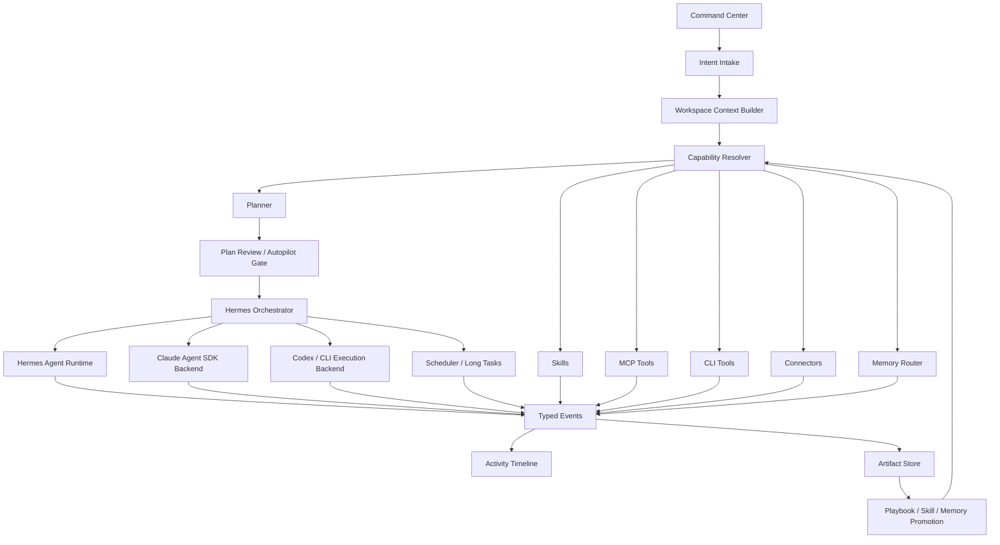

# Intent-First Product Implementation Plan

This document defines the target implementation for Cognix as an intent-first AI work
platform. The customer-facing product should not expose MCP, skills, CLI, agents,
scheduler, memory, or provider internals as primary concepts. Those are internal
capabilities selected by the system after it understands the user's intent.

## 1. Product Positioning

Cognix should behave like a workspace operator:

1. The user describes a goal.
2. Cognix analyzes the intent, workspace context, available capabilities, policy, cost,
   and risk.
3. Cognix proposes a clear plan:
   - what will be done
   - which outputs will be produced
   - what access is needed
   - which parts require confirmation
   - whether it is one-shot, long-running, scheduled, or multi-agent
4. The user chooses:
   - run directly
   - approve a recommended plan
   - edit constraints
   - reject
5. Cognix executes through Hermes orchestration, Claude Agent SDK, local tools, MCP,
   skills, CLI, connectors, scheduler, and memory routing.
6. The user receives structured artifacts, not raw logs.
7. Useful completed workflows can become playbooks, skills, schedules, or memory after
   explicit confirmation.

The product experience is "give me the result"; the implementation is a capability
router and execution fabric.

## 2. Non-Expert User Surface

Default user-facing areas:

- **Command Center**: one input box for intent, recent tasks, suggested actions.
- **Plan Review**: human-readable recommendations and risk/cost/access summary.
- **Activity Timeline**: current step, waiting approvals, tool progress, errors.
- **Artifacts**: final reports, datasets, files, notebooks, code patches, summaries.
- **Approvals**: only when the system needs consent for risk, cost, writes, external
  actions, or memory promotion.

Hidden or advanced-only areas:

- raw MCP server configuration
- raw skill package details
- API keys and provider routing internals
- scheduler cron expressions
- raw event stream
- agent runtime parameters
- policy JSON
- debug logs
- connector OAuth details

Configuration should be pre-seeded by operators, workspace templates, or admin setup.
Regular users should only select from safe, named capability presets when necessary.

## 3. Internal Capability Fabric



### 3.1 Hermes Control Plane

Hermes remains the product control plane. It owns:

- workspace boundaries
- policy and permission mode
- task lifecycle
- event protocol
- plan snapshots
- agent/team orchestration
- artifact production
- approvals and resume
- scheduling
- memory routing decisions

Hermes should call Claude Agent SDK, Codex/CLI, MCP, skills, and connectors as
execution backends rather than letting any backend own product state.

### 3.2 Execution Backends

Backends should implement a common interface:

- `prepare(context)`
- `estimate(plan_step)`
- `execute(step, stream)`
- `request_approval(reason, payload)`
- `resume(token, user_response)`
- `cancel(run_id)`
- `collect_artifacts(run_id)`

Initial backends:

- `hermes_agent`: native tool-calling Agent runtime.
- `claude_agent_sdk`: workspace-isolated coding/agent execution with permission mode
  and MCP bridge.
- `codex_cli`: local code/task execution backend, behind sandbox policy.
- `scheduler`: one-shot, long-running, recurring, retryable execution.
- `connector`: external actions such as Lark, WeChat, DingTalk, X, Instagram.

### 3.3 Capability Resolver

Capability Resolver receives intent + workspace context and returns ranked capabilities:

- installed skills
- available MCP tools
- allowed CLI tools
- available connectors
- workspace files
- previous playbooks
- memory snippets
- agent templates
- scheduler modes
- sandbox presets

Capabilities have structured metadata:

```json
{
  "id": "mcp.browser.search",
  "kind": "mcp_tool",
  "label": "Web search",
  "description": "Search public web pages for current information.",
  "risk_level": "medium",
  "requires_approval": false,
  "required_scopes": ["network"],
  "input_schema": {},
  "output_types": ["source", "summary"],
  "workspace_enabled": true
}
```

The planner should never invent unavailable capabilities. It should either select an
available capability or recommend enabling/installing one.

## 4. Memory And Context Strategy

Memory is a competitive feature, but it must be token-efficient and controllable.

### 4.1 Memory Layers

- **Hot memory**: tiny stable prompt files such as `USER.md` and `MEMORY.md`.
- **Warm memory**: current task state, plan state, active artifact, recent decisions.
- **Cold memory**: retrieved historical conversations, task outputs, artifacts.
- **Procedural memory**: skills, playbooks, SOPs, repeated workflows.
- **Deep memory**: optional user/workspace model and long-term preferences.

### 4.2 Memory Router

MemoryRouter should decide:

- what to retrieve
- what to summarize
- what to cite
- what to exclude
- what to ask before writing

It should output a bounded context pack:

```json
{
  "hot": [],
  "warm": [],
  "cold": [],
  "procedural": [],
  "deep": [],
  "citations": [],
  "token_budget": {
    "max": 12000,
    "used_estimate": 3400
  }
}
```

### 4.3 Memory Write Policy

Allowed automatic writes:

- task facts
- artifact summaries
- source references
- execution decisions

Require approval:

- personal preference
- user identity claims
- durable business rules
- playbook/skill promotion
- connector or external account associations

## 5. User Flow

### 5.1 Review-First Flow

1. User enters intent.
2. System creates intent snapshot.
3. Capability Resolver identifies usable skills/MCP/CLI/connectors/memory.
4. Planner returns a plan with recommended route.
5. UI shows:
   - recommended action
   - why this route
   - needed access
   - expected result
   - risk and approval points
6. User clicks Run.
7. Execution streams status and outputs.
8. Artifact opens automatically.
9. System suggests memory/playbook/skill promotion if useful.

### 5.2 Autopilot Flow

Used only when:

- workspace policy allows it
- no risky external side effects
- no broad file writes
- cost is under threshold
- required capabilities are already enabled

The UI still shows the plan, but execution can start immediately.

### 5.3 Human-In-Loop Flow

Approval request types:

- `plan_confirmation`
- `file_write`
- `command_execution`
- `mcp_tool_call`
- `connector_action`
- `memory_write`
- `playbook_promotion`
- `cost_escalation`
- `need_user_input`

The user sees plain language, not tool payloads by default.

## 6. Planner Contract

The planner should return a stable schema:

```json
{
  "summary": "Pull today's authorized coupon-code data and produce a report.",
  "intent_type": "data_collection",
  "execution_mode": "review_first",
  "confidence": 0.82,
  "recommended_route": {
    "backend": "claude_agent_sdk",
    "reason": "Requires browser/file workflow and possible authenticated portal steps."
  },
  "steps": [
    {
      "id": "step_1",
      "action": "analyze_source",
      "description": "Confirm the authorized data source and available export/API path.",
      "capabilities": ["memory.workspace_context", "skill.data_intake"],
      "approval_required": false
    },
    {
      "id": "step_2",
      "action": "collect_data",
      "description": "Use approved API/export/browser automation to collect coupon data.",
      "capabilities": ["mcp.browser", "cli.python"],
      "approval_required": true
    },
    {
      "id": "step_3",
      "action": "produce_artifact",
      "description": "Generate cleaned dataset and summary report.",
      "capabilities": ["skill.data_cleaning", "artifact.dataset"],
      "approval_required": false
    }
  ],
  "capability_recommendations": {
    "skills": [],
    "mcp_tools": [],
    "cli_tools": [],
    "connectors": []
  },
  "risk": {
    "level": "medium",
    "reasons": ["May involve authenticated third-party platform data."]
  },
  "expected_artifacts": ["dataset", "summary_report"],
  "memory_plan": {
    "read": ["workspace_procedures"],
    "write_candidates": ["successful_data_pull_playbook"]
  }
}
```

Current implementation can keep `create_agent` and `create_task` internally, but the
UI should describe business actions rather than implementation operations.

## 7. Required Product Changes

### P0: Make The Main Path Reliable

1. Fix planner apply reliability:
   - reuse an existing workspace agent when a generated name already exists
   - avoid global agent-name collisions
   - skip dependent steps when dependencies fail
   - never create an `agent_call` task with empty `agent_id`
   - mark the final plan as `failed` when any required step fails
2. Make Simple Mode the default command center:
   - intent input
   - plan preview
   - run/reject/edit buttons
   - current execution status
   - automatic artifact opening
3. Hide advanced configuration:
   - collapse raw settings behind Advanced
   - move model provider/API/token/MCP raw config out of the default workspace path
4. Capability-aware planning:
   - planner receives installed skills, MCP tools, connector state, CLI allowlist,
     memory summaries, sandbox policy, and provider status
   - planner can recommend missing capabilities but cannot rely on unavailable ones
5. Artifact-first output:
   - successful tasks produce structured artifacts
   - error artifacts include root cause and next action, not only logs

### P1: Internal Capability Routing

1. Add `CapabilityResolver`.
2. Add common `ExecutionBackend` interface.
3. Route plan steps to Hermes, Claude SDK, Codex/CLI, scheduler, MCP, skills, or
   connectors.
4. Normalize events from all backends into:
   - `status`
   - `todo`
   - `delta`
   - `tool_call`
   - `tool_result`
   - `approval_request`
   - `artifact`
   - `error`
   - `done`
5. Add policy checks before every backend action.

### P2: Memory And Self-Evolution

1. Implement `MemoryRouter`.
2. Implement `ContextBudgetManager`.
3. Add source attribution for memory.
4. Add memory write approval.
5. Add Artifact to Playbook to Skill promotion flow.
6. Add workspace templates with preinstalled capabilities.

### P3: Commercial And Admin Packaging

1. Admin/operator capability presets.
2. Workspace templates for target customer groups.
3. BYOK or paid entitlement decision screen.
4. Usage and cost estimates in plain language.
5. Audit trail for enterprise workspaces.

## 8. UI Information Architecture

Default:

- **Work**: command center, active tasks, recent outputs.
- **Artifacts**: reports, datasets, notebooks, files.
- **Approvals**: pending confirmations and questions.
- **History**: previous sessions and tasks.

Advanced:

- Agents
- Skills
- MCP
- Connectors
- Scheduler
- Policy
- Provider
- API Access
- Event logs

Top-level settings should distinguish:

- Account settings: profile, billing, global providers, API access tokens.
- Workspace settings: selected provider route, memory, policy, capability presets.
- Admin settings: raw MCP/connector/provider templates.

## 9. Immediate Implementation Slice

The next engineering slice should be:

1. Fix planner apply reliability.
2. Add `CapabilityResolver` skeleton.
3. Feed capability snapshot into planner.
4. Simplify Simple Mode into command center:
   - intent
   - recommendation
   - plan card
   - run status
   - artifact preview
5. Move raw MCP/Skill/Provider/Scheduler details to Advanced.
6. Add artifact auto-open after successful plan apply.

This slice turns the current expert console into a credible product path without
requiring all long-term memory and self-evolution work to be finished first.

## 10. Acceptance Criteria

For a non-technical user:

- They can enter "pull authorized coupon-code data and make today's report".
- Cognix explains the compliant route and asks for required source/API/export access.
- Cognix recommends relevant internal skills/MCP/CLI capabilities without exposing raw
  configuration.
- Cognix either asks for confirmation or runs directly based on policy.
- Cognix streams understandable progress.
- Cognix returns a structured artifact.
- If execution fails, the output explains the root cause and the next recoverable step.

For an operator/admin:

- They can preconfigure providers, MCP servers, skills, connector templates, CLI
  allowlists, sandbox presets, and workspace templates.
- They can audit what ran, which capability was used, and which approval allowed it.

