# Planner Orchestrator Refactor Plan

This document defines the task-first planning layer for Cognix. The goal is to
move the product from manual Agent/Workflow configuration to:

1. User describes a goal.
2. Cognix discovers workspace capabilities.
3. The planner classifies the intent and proposes an executable plan.
4. User confirms the plan.
5. Cognix creates agents, mounts skills/MCP, schedules tasks, runs work, and
   saves artifacts.

## Product Boundary

The planner is the product entrypoint. Hermes remains the control plane and
runtime foundation. Claude Agent SDK, Codex-like sandbox execution, MCP,
connectors, scheduler, memory, and skills are capability backends selected by
the planner.

## Target Flow

```mermaid
flowchart LR
    USER["User Goal"] --> INTENT["Intent Classification"]
    INTENT --> DISCOVERY["Capability Discovery"]
    DISCOVERY --> PLAN["Structured Plan Preview"]
    PLAN --> APPROVAL["Human Approval"]
    APPROVAL --> APPLY["Apply Plan"]
    APPLY --> EVENTS["Execution Events"]
    EVENTS --> ARTIFACT["Artifact"]
    ARTIFACT --> MEMORY["Memory / Playbook / Skill"]
```

## Planner Decisions

Every plan should include:

- `intent_type`: chat, task, research, automation, file_operation, integration,
  multi_agent, scheduled.
- `execution_mode`: chat, once, long_running, scheduled, multi_agent.
- `recommended_agents`: proposed primary and child agents with role and reason.
- `recommended_skills`: matching skills with availability and reason.
- `recommended_mcp_tools`: matching MCP tools with server/tool and reason.
- `scheduling`: whether a task should be immediate, interval, or cron.
- `sandbox_permissions`: permission categories that need user review.
- `expected_artifacts`: user-facing outputs, not raw logs.
- `capability_snapshot`: compact non-secret snapshot of provider, skills, MCP,
  and connectors used to make the plan.

## Implementation Phases

### Phase 1: Structured Planner MVP

Status: in progress.

- Extend `WorkspacePlan` schema with intent, execution mode, recommendations,
  scheduling, and capability snapshot.
- Build workspace capability discovery from provider resolver, installed skills,
  workspace-enabled skills, MCP server configs, and connectors.
- Normalize LLM output and provide a heuristic fallback when provider planning
  fails or BYOK is not configured.
- Display planner decisions in the Plan card.
- Convert common provider/runtime errors into user-actionable messages.

### Phase 2: Apply Semantics

- Create or reuse agents based on plan role and workspace scope.
- Mount enabled skills and discovered MCP tools to runtime agents.
- For recurring plans, register scheduler jobs immediately and persist
  `next_run`.
- For one-shot plans, run immediately and open the created artifact.
- Record plan step outputs and errors in the plan snapshot.

### Phase 3: Human-In-The-Loop

- Convert plan confirmation into a first-class approval request when workspace
  policy is `ask` or `plan`.
- Add editable plan fields before apply.
- Support user answers for planner questions before execution.
- Resume long-running plans after approval.

### Phase 4: Multi-Agent Teams

- Split complex plans into primary agent plus child agents with explicit roles.
- Add team status snapshots for each child agent/task.
- Route artifacts and intermediate outputs back to the primary task.

### Phase 5: Memory And Self-Evolution

- Add a `MemoryRouter` to select hot/cold/procedural/deep memory within a token
  budget.
- Save source-attributed artifacts.
- Add artifact-to-playbook-to-skill promotion with confirmation.
- Let planner recommend reusable playbooks and skills from prior successful
  artifacts.

## Current Slice

The current implementation slice focuses on Phase 1 plus part of Phase 2:

- Planner creates structured plans with intent type, execution mode, capability
  snapshot, skill/MCP recommendations, scheduling intent, and expected outputs.
- Applying plans can create agents/tasks, register scheduled jobs, run one-shot
  tasks, and save artifacts.
- Frontend Plan cards expose planner decisions in user-facing terms.

