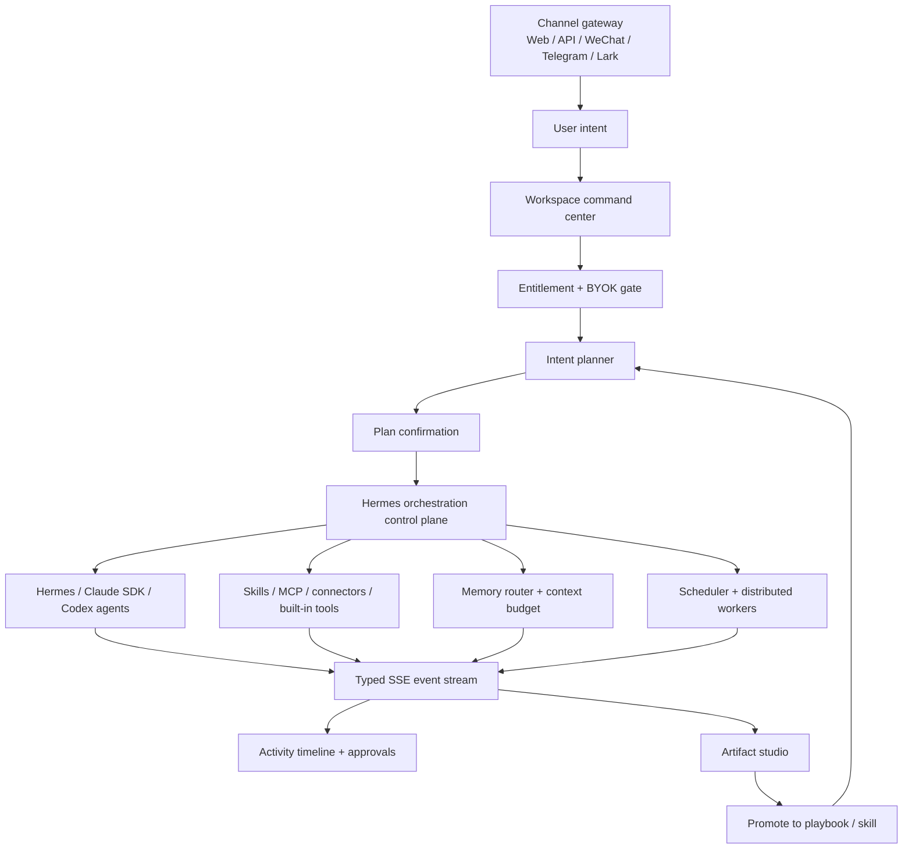

# Cognix Product Refactor Plan

This document is the implementation map for moving Cognix from an expert-facing agent console into a task-first, workspace-scoped, self-evolving agent product.

## 1. Target Product Shape

Cognix should feel like a workspace AI operator, not a form-heavy agent admin panel.

The default user flow should be:

1. User opens a workspace and describes what they want done.
2. Cognix checks whether the workspace can run the request:
   - If BYOK is configured, use the workspace provider and model.
   - If BYOK is not configured, require a commercial plan or trial entitlement.
3. Cognix analyzes the request, proposes an execution plan, required skills, connectors, memories, sandbox permissions, and expected artifacts.
4. User reviews a simple plan and confirms.
5. Cognix creates or reuses Agents, Tasks, Skills, MCP tools, connectors, memories, and schedules.
6. Execution streams through a human-readable activity view with approvals only when needed.
7. Final outputs land as structured artifacts, not just chat text.
8. Useful procedures can be promoted into reusable workspace playbooks or skills.

The current Hermes runtime remains the control plane. Claude Agent SDK, Codex-style execution, MCP, connectors, scheduler, RAG, and memory become execution and capability backends under that control plane.

## 2. Design Principles

- **Task-first, not Agent-first**: most users should start from an intent, not from creating Agents manually.
- **Workspace as boundary**: model provider, sandbox, memory, skills, files, connectors, schedules, and artifacts are all scoped to a workspace.
- **BYOK or paid plan**: model execution must be gated by either a configured provider key or a billing entitlement.
- **Small prompt, routed context**: never push all memory into the prompt. Route and compress hot, cold, procedural, and deep memory.
- **Human-readable operations**: technical logs exist, but the default UI shows current step, decisions, approvals, and outputs.
- **Approval before irreversible actions**: file writes, connector posts, payments, external side effects, and broad workspace mutations must pass policy.
- **Artifacts over transcripts**: meaningful outputs become versioned, source-backed artifacts.
- **Self-evolution is explicit**: the system can recommend new skills, playbooks, schedules, and memory writes, but important changes are reviewable.

## 3. Product Architecture

## 4. Existing Foundation

Already implemented or mostly present:

- Hermes Core Agent runtime with tool calling, events, memory, and permission mode persistence.
- Multi-agent orchestration primitives: Sequential, Parallel, Router, Loop.
- SchedulerEngine, TaskExecutor, active task restore, DB-backed leases, retry backoff, cancel/replay.
- API router split, `/api/v1/skills`, `/rpc`, websocket auth, and RBAC.
- SSE event protocol: `delta`, `tool_call`, `tool_result`, `approval_request`, `error`, `done`.
- Human-in-loop approvals with approve, reject, respond, resume, and streaming resume APIs.
- Unified orchestration events and run snapshots for intent, plan, execution, artifact, memory, and playbook stages.
- Claude Agent SDK bridge with workspace cwd, permission mapping, MCP config mapping, and approval callback.
- MCP lifecycle and tool discovery/call path.
- Connector framework for X and Instagram with OAuth, encrypted credentials, debug calls, and permission gating.
- Provider-neutral channel gateway foundation with `ChannelEvent` and `MessageRouter`.
- Four memory pipeline concept: hot, cold, procedural, deep.
- Obsidian-compatible memory vault projection for cold memory review.
- Local-first workspace storage under `~/.cognix`.

Main gap: these capabilities are still exposed as expert controls. The product needs a higher-level command flow that composes them automatically.

## 5. Target Modules

### 5.1 Workspace Model Provider

Purpose: make BYOK a first-class workspace setting.

Backend:

- Store provider config per workspace:
  - provider type: `openai-compatible`, `openai`, `anthropic`, `local`, `custom`
  - base URL
  - default model
  - encrypted API key
  - optional organization/project
  - enabled flag
  - last test result
- Never return the raw key after save.
- Add test endpoint for model list and a small completion check.
- Make workspace chat, planner, Hermes Agent, and Claude/Codex backends resolve provider config consistently.

Frontend:

- Add Settings > Model Provider.
- Show masked key, base URL, default model, and test status.
- Explain clearly that API Access Tokens are for Cognix API access, not LLM provider access.

Acceptance:

- A workspace can run a chat/agent task using its configured NewAPI/OpenAI-compatible base URL and model.
- Missing provider falls back to billing entitlement gate.
- No API response leaks the full key.

### 5.2 Entitlement And Plan Enforcement

Purpose: make billing meaningful.

Backend:

- Central `EntitlementService` with checks for:
  - model execution without BYOK
  - max workspaces
  - max active Agents
  - task runs per day
  - scheduler concurrency
  - connectors and MCP enablement
  - long-running tasks
  - deep research / web search
- Track usage at execution boundaries, not only API calls.
- Return structured upgrade errors.

Frontend:

- Replace silent disabled states with an upgrade/BYOK decision screen.
- Show usage in plain language.

Acceptance:

- User without BYOK and without paid entitlement cannot execute paid model workflows.
- BYOK users can execute within workspace policy even on free plan, subject to local/product limits.

### 5.3 Intent Planner

Purpose: convert a user requirement into an executable workspace plan.

Backend:

- Add planner API:
  - `POST /api/v1/workspaces/{workspace_id}/plans`
  - `GET /api/v1/workspaces/{workspace_id}/plans/{plan_id}`
  - `POST /api/v1/workspaces/{workspace_id}/plans/{plan_id}/apply`
  - `POST /api/v1/workspaces/{workspace_id}/plans/{plan_id}/reject`
- Planner output:
  - summary
  - required agents
  - required tasks
  - suggested skills
  - suggested MCP servers
  - suggested connectors
  - memory reads/writes
  - sandbox permissions
  - schedule suggestions
  - expected artifacts
  - approval requirements
  - estimated cost/token range
- Plans must be JSON schema validated.
- Applying a plan creates or updates Agents, Tasks, Skills, schedules, and workspace config through existing services.

Frontend:

- Add task-first composer as the primary workspace entry.
- Show plan cards in user language:
  - what will happen
  - what access is needed
  - what outputs will be produced
  - what can be changed before running

Acceptance:

- User can enter a broad task and receive a structured executable plan.
- Applying a plan creates concrete runtime entities and starts or schedules execution.

### 5.4 Sandbox Policy

Purpose: make execution boundaries enforceable across Hermes, Claude SDK, Codex, MCP, scheduler, and connectors.

Policy dimensions:

- file roots
- readable paths
- writable paths
- blocked paths
- command allowlist/denylist
- network policy
- MCP server allowlist
- connector scopes
- secret access
- max runtime
- approval mode
- audit logging

Backend:

- Add `WorkspaceSandboxPolicy`.
- Add central `SandboxPolicyService`.
- Enforce before tool execution, file operation, connector call, MCP call, and SDK backend execution.
- Normalize denials and approval requests into the existing approval system.

Frontend:

- Add simple policy presets:
  - Safe read-only
  - Workspace write
  - Ask before changes
  - Advanced custom
- Hide raw policy JSON behind advanced view.

Acceptance:

- A disallowed file path, command, MCP tool, or connector action is blocked consistently.
- `ask` and `plan` modes create approval requests instead of silently running.

### 5.5 Memory Router And Context Budget

Purpose: reduce token usage while improving continuity.

Memory layers:

- Hot memory: `USER.md`, `MEMORY.md`, always small and stable.
- Warm memory: active task state, plan state, recent decisions, current artifact state.
- Cold memory: retrievable history from SQLite/vector index.
- Procedural memory: skills, SOPs, playbooks.
- Deep memory: optional user model, long-term preference profile.

Backend:

- Add `ContextBudgetManager`.
- Add `MemoryRouter` that decides:
  - what to retrieve
  - what to summarize
  - what to omit
  - what to write back
- Add source attribution for retrieved memory.
- Add memory write policy:
  - auto-write low-risk task facts
  - require confirmation for user preferences, personal traits, or durable identity claims
  - expire noisy operational traces

Frontend:

- Add memory visibility panel:
  - what Cognix remembered
  - why it was used
  - remove or pin memory

Acceptance:

- Long conversations use bounded context.
- Retrieved memory includes sources.
- User can inspect and delete durable memories.

### 5.6 Skills Marketplace And Playbook Promotion

Purpose: make self-evolution operational, not magical.

Backend:

- Planner can recommend skills from local and remote marketplace indexes.
- Executed task flows can be summarized into playbooks.
- Playbooks can be promoted into workspace skills after confirmation.
- Track skill provenance and version.

Frontend:

- Show recommended skills during plan confirmation.
- Add "promote this workflow" action on successful artifacts/tasks.

Acceptance:

- A repeated task can become a reusable workspace skill/playbook with human confirmation.

### 5.7 Artifact Studio

Purpose: turn outputs into reusable, inspectable deliverables.

Artifact types:

- report
- brief
- plan
- checklist
- dataset
- code patch
- presentation outline
- timeline
- FAQ
- playbook
- decision log
- notebook

Data model:

- `id`
- `workspace_id`
- `type`
- `title`
- `summary`
- `content`
- `sources`
- `related_tasks`
- `related_agents`
- `created_by`
- `status`
- `version`
- `metadata`
- `created_at`
- `updated_at`

Backend:

- Add artifact store and API:
  - `GET /api/v1/workspaces/{workspace_id}/artifacts`
  - `POST /api/v1/workspaces/{workspace_id}/artifacts`
  - `GET /api/v1/workspaces/{workspace_id}/artifacts/{artifact_id}`
  - `PATCH /api/v1/workspaces/{workspace_id}/artifacts/{artifact_id}`
  - `GET /api/v1/workspaces/{workspace_id}/artifacts/{artifact_id}/versions`
  - `POST /api/v1/workspaces/{workspace_id}/artifacts/{artifact_id}/export`
- Task completion can create or update artifacts.
- Artifacts reference sources and execution events.

Frontend:

- Add NotebookLM-inspired artifact layout:
  - left: sources and workspace files
  - center: artifact viewer/editor
  - right: provenance, actions, related tasks
- Support Markdown, Mermaid, KaTeX, code highlight, tables, citations, and export.

Acceptance:

- A task produces a durable artifact with sources.
- User can reopen, edit, version, and export the artifact.

### 5.8 Simplified Workspace UI

Purpose: make the product usable by non-experts.

New default IA:

- Home: task composer and recent outputs.
- Work: active tasks and timeline.
- Artifacts: reports, notebooks, plans, datasets.
- Capabilities: skills, connectors, MCP, model provider.
- Settings: account, billing, sandbox, API tokens.

Right panel rules:

- Default: current step, approvals, outputs.
- Advanced: raw event stream, agent internals, MCP status, debug details.
- Avoid showing every runtime concept by default.

Acceptance:

- A non-technical user can run a task without understanding Agent, MCP, scheduler, or permission internals.

## 6. Implementation Roadmap

### Phase 0: Documentation And Alignment

Status: this document.

Deliverables:

- Product refactor plan.
- Updated documentation links.
- Clear P0/P1/P2 breakdown.

### Phase 1: Workspace Provider + Entitlement Gate

Priority: P0

Deliverables:

- Workspace provider store with encrypted key.
- Provider get/update/test APIs.
- Settings UI for BYOK.
- Shared provider resolver used by workspace chat and Agent execution.
- Billing/BYOK gate for paid model execution.

Suggested commits:

- `feat(settings): add workspace model provider config`
- `feat(runtime): resolve workspace provider for agent execution`
- `feat(billing): enforce byok or entitlement gate`
- `feat(web): add model provider settings`

### Phase 2: Intent Planner And Plan Apply

Priority: P0

Deliverables:

- Plan schema and planner service.
- Plan API.
- Plan confirmation UI.
- Apply plan to create/reuse Agents, Tasks, Skills, schedules.
- SSE event path from plan execution.

Suggested commits:

- `feat(planner): add workspace intent plan schema`
- `feat(api): add workspace plan lifecycle endpoints`
- `feat(runtime): apply plans to agents and tasks`
- `feat(web): add task-first plan confirmation flow`

### Phase 3: Sandbox Policy Enforcement

Priority: P0

Deliverables:

- Workspace sandbox policy model.
- Shared policy evaluator.
- File/tool/MCP/connector/SDK checks.
- Policy presets in UI.
- Audit log events.

Suggested commits:

- `feat(sandbox): add workspace policy service`
- `feat(runtime): enforce sandbox policy across tools`
- `feat(web): add sandbox policy presets`

### Phase 4: Artifact Studio MVP

Priority: P1

Deliverables:

- Artifact data model/store/API.
- Task completion artifact creation.
- Artifact viewer UI.
- Markdown, Mermaid, KaTeX, code highlight support.
- Source and provenance display.

Suggested commits:

- `feat(artifacts): add workspace artifact store`
- `feat(tasks): create artifacts from task outputs`
- `feat(web): add artifact studio`

### Phase 5: Memory Router + Context Budget

Priority: P1

Deliverables:

- ContextBudgetManager.
- MemoryRouter.
- Retrieval attribution.
- Obsidian-compatible Markdown vault projection.
- Memory write policy and review UI.
- Token budget telemetry.

Suggested commits:

- `feat(memory): add context budget manager`
- `feat(memory): route hot cold procedural and deep memory`
- `feat(web): add memory visibility controls`

### Phase 6: Playbook And Skill Self-Evolution

Priority: P1

Deliverables:

- Workflow-to-playbook summarizer.
- Playbook store.
- Promote playbook to skill.
- Marketplace recommendation integration in planner.

Suggested commits:

- `feat(playbooks): add workspace playbook store`
- `feat(skills): recommend skills during planning`
- `feat(web): promote completed workflow to playbook`

### Phase 7: Distributed Runtime Completion

Priority: P1

Deliverables:

- Worker registration hardening.
- Task assignment across nodes.
- Lease renewal and timeout handling.
- Distributed lock for singleton schedules.
- Runtime node capacity routing.

Suggested commits:

- `feat(runtime): add distributed worker assignment`
- `feat(scheduler): add singleton schedule locks`
- `feat(api): expose runtime node capacity`

### Phase 8: Connector And Remote Bot Productionization

Priority: P2

Deliverables:

- Provider-neutral channel event model.
- MessageRouter for direct Agent dispatch and async Task dispatch.
- Complete signature verification per platform.
- Group chat context binding.
- Async task trigger from bot messages.
- Response callback/writeback.
- Connector capability recommendations from planner.

Suggested commits:

- `feat(bots): complete remote callback verification`
- `feat(connectors): bind external chats to workspace context`
- `feat(planner): recommend connector capabilities`

### Phase 9: UI Simplification And Commercial Packaging

Priority: P2

Deliverables:

- New workspace command center.
- Simplified right panel.
- Advanced developer/debug mode.
- Plan usage display.
- Upgrade/BYOK decision UI.

Suggested commits:

- `feat(web): add workspace command center`
- `feat(web): simplify activity and approval panels`
- `feat(web): add upgrade or byok decision flow`

## 7. P0 Acceptance Checklist

- Workspace Settings can configure and test an OpenAI-compatible provider.
- Workspace chat and Agent execution use the workspace provider.
- A user without BYOK or paid entitlement is blocked before model execution.
- A user can describe a task and receive a structured plan.
- A confirmed plan creates/reuses Agents and Tasks.
- Sandbox policy blocks disallowed file/tool/connector/MCP actions.
- `ask` and `plan` modes produce approval requests with resumable execution.
- The default UI path does not require users to manually create an Agent first.

## 8. P1 Acceptance Checklist

- Completed tasks produce durable artifacts with sources.
- Artifact viewer supports Markdown, Mermaid, KaTeX, code blocks, and citations.
- Memory retrieval stays under a bounded context budget.
- Retrieved memory has source attribution.
- User can inspect, pin, and delete memories.
- Successful workflows can be promoted into playbooks or skills.
- Distributed scheduler can assign executable work across runtime nodes.

## 9. P2 Acceptance Checklist

- Remote bot callbacks are signature verified and can trigger async workspace tasks.
- External chat threads are bound to workspace context.
- Connector recommendations appear during planning.
- Non-expert UI hides raw runtime details by default.
- Billing and BYOK are understandable from the first-run experience.

## 10. Open Decisions

- Whether artifacts should be stored in SQLite/Postgres first, local JSON first, or both with a repository abstraction.
- Whether vector retrieval should use SQLite extensions, a local vector store, or provider embeddings first.
- Whether Codex execution should be integrated through a local sandbox process, CLI bridge, or a pluggable execution backend interface.
- Whether workspace self-evolution recommendations should require approval every time or allow trusted automatic promotion for low-risk playbooks.
- How much of the current expert Agent/Task/Skills UI should remain visible by default versus moved into advanced mode.

## 11. First Implementation Slice

Recommended next slice:

1. Implement workspace model provider BYOK settings.
2. Route workspace chat and Agent execution through that provider.
3. Add entitlement/BYOK execution gate.
4. Add basic planner API returning validated JSON plans.
5. Add plan confirmation UI that can create one Agent and one Task.

This slice changes the product from "manually configure an Agent, then run it" to "describe a task, confirm the plan, then run it" while preserving the existing Hermes runtime.
